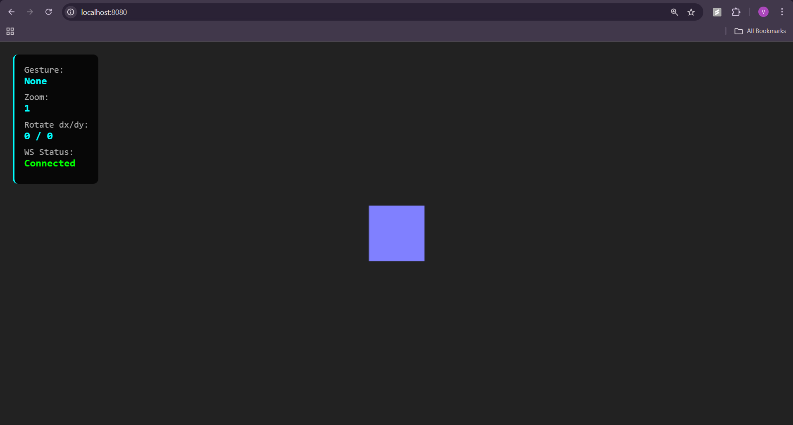
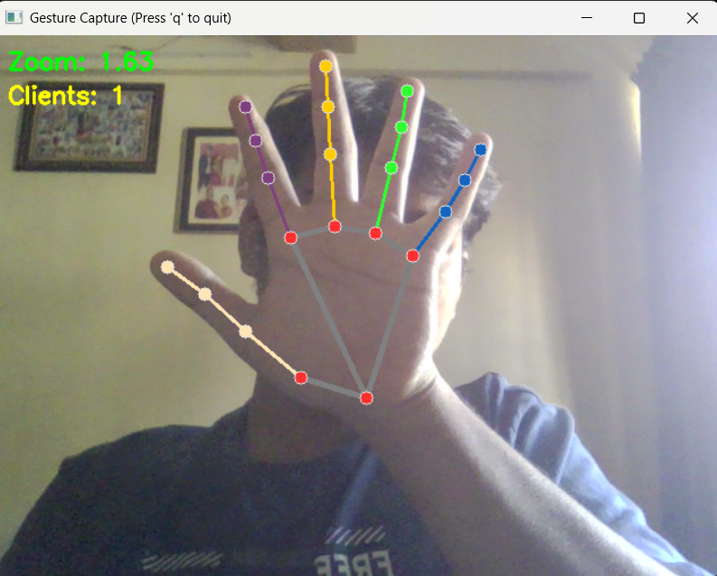

<h1 align="center">Gesture-Controlled 3D Viewer</h1>

  Real-time 3D interaction using MediaPipe, WebSockets, and Three.js

---

✨ Gesture-Controlled 3D Viewer
A real-time 3D interaction system using hand-tracking, MediaPipe, WebSockets, and Three.js

🎯 Overview
This project demonstrates a real-time system that allows users to interact with a 3D model using hand gestures.
It uses:
MediaPipe Hands (Python) → gesture detection
WebSockets → sends gesture data to browser
Three.js → renders & controls 3D object
Custom gestures → zoom, rotate, and more

🚀 Features
✔️ Real-time hand tracking
✔️ Gesture-based zoom and rotation
✔️ Lightweight WebSocket communication
✔️ Three.js 3D rendering
✔️ Python server (no frameworks required)
✔️ Works with any webcam

📁 Project Structure
gesture_3d_viewer/
│── server.py          # Python WebSocket + Mediapipe gesture server
│── static/
│   └── index.html     # 3D viewer with Three.js + WebSocket client
│── Project Report.docx
│── venv/ (ignored)

🛠️ Requirements
Python 3.9+
pip
Webcam
Modern browser
Three.js (imported via CDN)

▶️ How to Run the Project
1. Activate virtual environment (optional)
.\venv\Scripts\activate
2. Install dependencies
pip install mediapipe opencv-python websockets
3. Run the Python gesture server
python server.py
4. Open the 3D viewer

Navigate in the browser to:
👉 http://localhost:8080

🖐️ Gesture Controls
Gesture	Action
Pinch	Zoom in/out
Index finger pointing	Rotate model
Hand open	Stop interaction

📷 Demo Screenshots
---

## 📸 Demo & Screenshots

### 🖥️ 3D Viewer Interface  
This is the main Three.js viewer where gestures control zoom and rotation.

---

### ✋ Real-Time Gesture Detection (MediaPipe)  
The Python server tracks hand landmarks, detects pinch & rotation, and sends gestures to the browser via WebSockets.

---

### 🧪 WebSocket + Server Output  
The Python backend logs camera startup, WebSocket connections, and real-time gesture events.

---

📜 License
MIT License (recommended — will add later)

👤 Author
Vedant Bhandare
Gesture-controlled 3D systems • Computer Vision • Interactive UI
